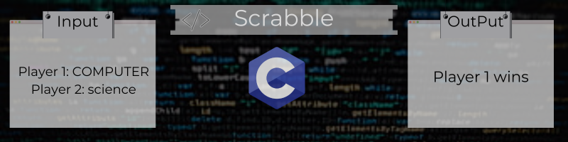
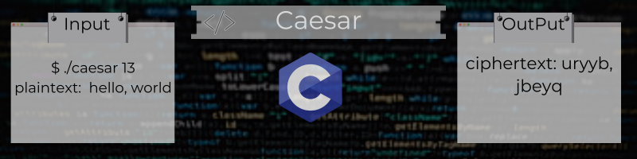
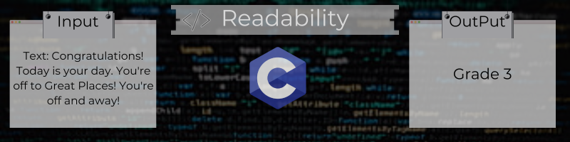

# cs50x-Arrays
Preprocessing. Compiling. Assembling. Linking. Debugging. Arrays. Strings. Command-Line Arguments. Cryptography.

## Second Week Projects:

## Lab

### [Scrabble](https://github.com/Henalecam/cs50x-Arrays/tree/main/scrabble)

The program we’ll write will be called **scrabble**. And it will **compute and print out the “value” of the word**, as though it were to be used in a game of Scrabble.

## Problems

### [Caesar](https://github.com/Henalecam/cs50x-Arrays/tree/main/caesar)

The program we’ll write will be called **caesar**. And it will **encrypt messages using Caesar’s cipher**.

### [Readability](https://github.com/Henalecam/cs50x-Arrays/tree/main/readability)

The program we’ll write will be called **readability**. And it will **compute the approximate grade level needed to comprehend some text**.

